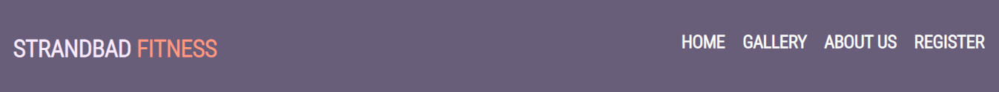
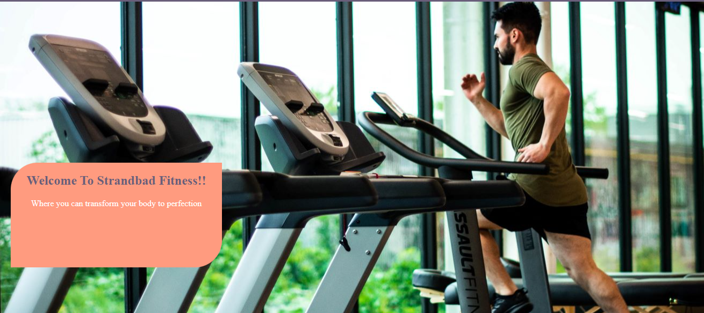
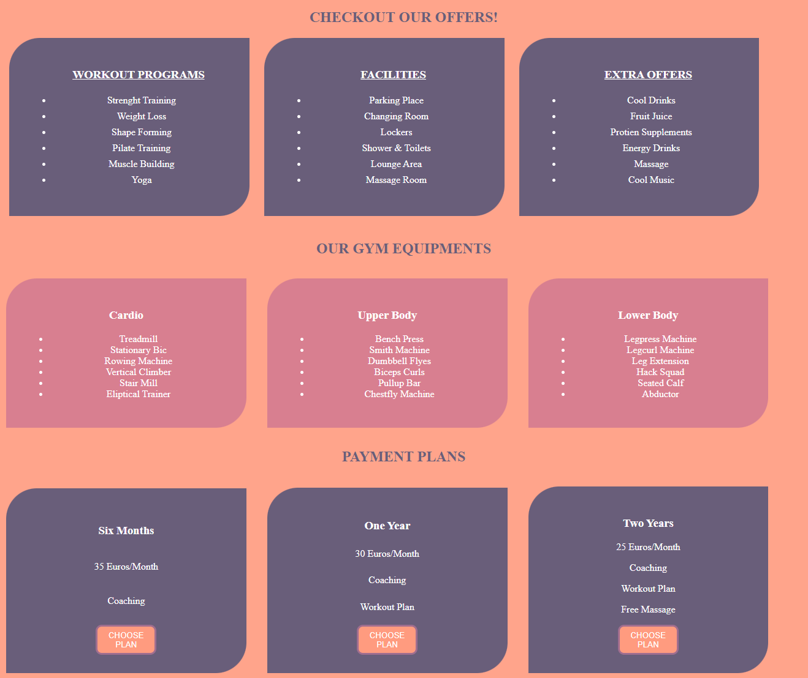
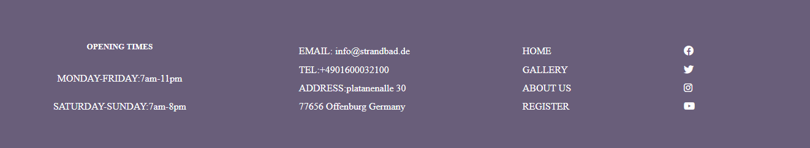
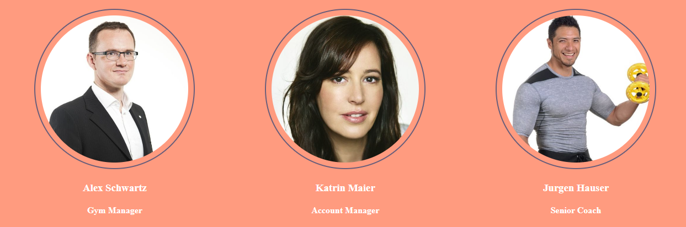
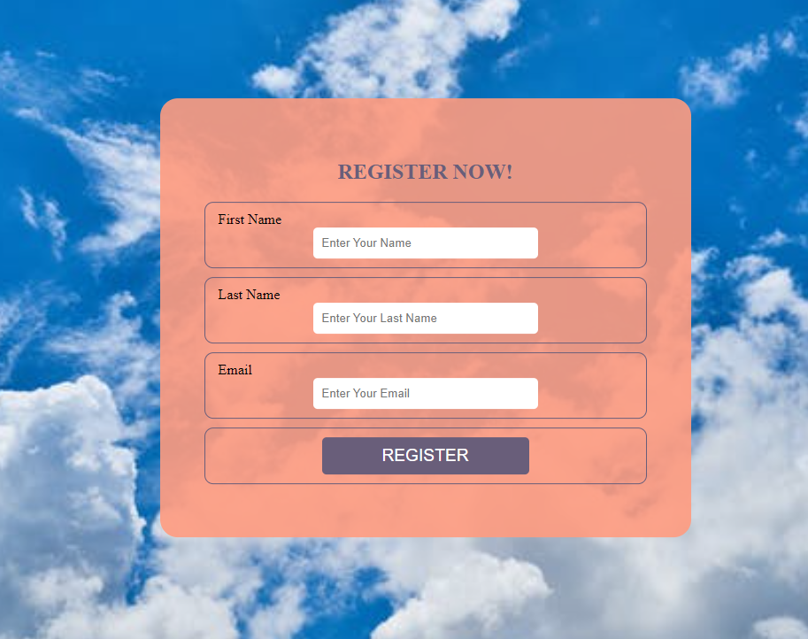
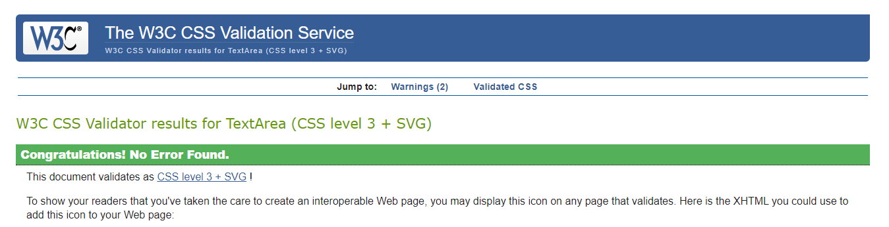

Strendbad Fitness is a fictional gym center where people who love fitness can access and register for membership

based on their choice of plan which can be a six months to a two years plan. Users will be abe to navigate 

through the services provided by the gym the facilities and all the machines at the gyms disposal .

#Features

**Navigation**

At the left of the navigation is the gyms logo Strandbad Fitness with a white and pink color.

At the right side of the navigation are the navigation links which includ the home page, gallery, about us and a link to a registration page

**Hero image**

The Hero image is a man working out on a treadmill machine which tells the user exactly what this site is about.

On the leftside of the image is a messagege welcoming the user to the gym strandbad fitness

**Services Section**

The services section contain all the services they offer and the facillities provided for their gym members and all the 

the working out machines at their disposal. 

the payment plans also can be seen on the services section which when a choosen plan is cliked it directs you straight to

the registration page to register for a membership

**Footer**
The footer area consist of the gyms opening and closing time, contact information, a navigation menu to the different pages

and social links to the various social page of the site.

and links to the gyms social media pages which opens in a new tab

**Gallery**

The gallery is a collection of photos of their gym members on training sessions.

**About us**

The about us page consist of information about the gym and those who run the gym the Managing director the Finance manager,

and the senior coach of the gym

**Registration Page**

The registration page is where potential gym members can register for membership
.
the form include an input area for first name, last name email and Register button.

###Colors

**Background color:**

  -Body: #FF9B7F
   
  -Header: #695E7A
   
  -Main area: #695E7A #D87F90
   
  -Footer: #695E7A
   
**Font-colors:**

  -Logo: #FF9B7F #FAEAFF
   
**Font-Family:** Roboto+condensed.

**Backup Fonts:** Arial, Helvetica, sans-serif.

##Validator Testing

**HTML**

   No errors were found when testing the site  for bugs at [WC3 validator](https://validator.w3.org/)

   
   
**CSS**
   No errors where identified after testing the site at [(jigsaw) validator](https://jigsaw.w3.org/css-validator/)

   
   
**SEO Testing**

  -Light House

**Unfixed Bugs**

There were no unfixed bugs

**Deployment**

##Credits

###Contents

The font for the site was taken from google fonts

The address for submiting the form was taking from the [code institute] form address(https://codeinstitute.net/)

###Media

The Photos in the website where taken from [Pixabay] (https://www.pixabay.com/) and [Pexels](https://www.pexels.com/)

The social media icons on the footer of the page was taken from [Font-Awesome](https://fontawesome.com/icons)

The color pallet for the StrandBad Fitness side was taken from [Mycolor-space](https://mycolor.space/)

**Technology and programms used**

**Github**

Github was used as a hosting platform for storing and tracking this project and version control.

**Font Awesome**

  -For icons social media icons
  
**Google Fonts

  -For fonts used in this side

**Gitpod**

The project started at gitpod and carried on up to the stage of designing the web for mobile and tablet 

responsiveness that is when it migrated to Codeanywhere.

**Codeanywhere**

This is the platform we completed the project starting from designing the site for different screen size up

to writing the README.md file

**Languages used** 

 -HTML5

 -CSS3

